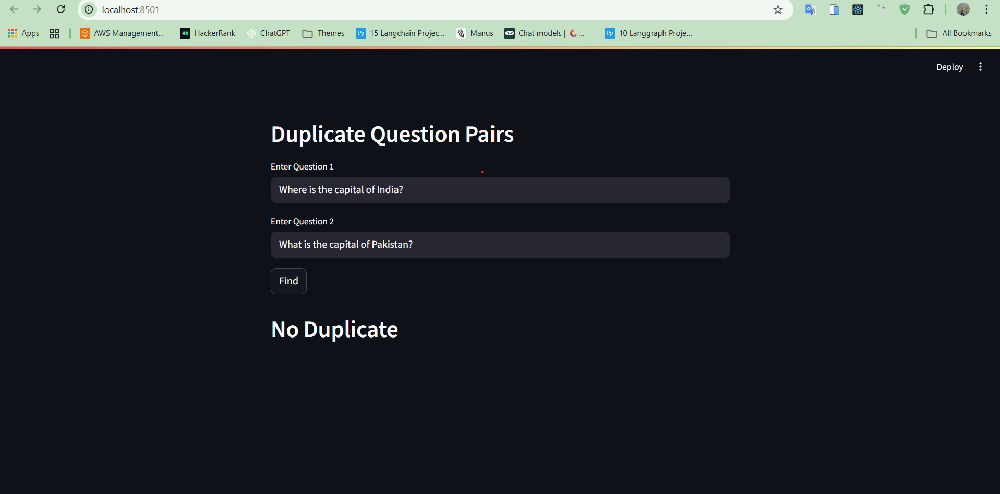

# Quora Duplicate Question Detection (NLP + Streamlit GUI)

This project predicts whether two questions from Quora are **duplicates** of each other or not.  
It uses **Natural Language Processing (NLP)** and **Machine Learning**, and provides a **Streamlit Web App** interface.

---

## 📸 UI Screenshot

---

## 🚀 Features
- Input: Two text questions.
- Output:  
  - `1` → Duplicate questions  
  - `0` → Not duplicate
- Clean and interactive **Streamlit GUI**.
- Preprocessing with **BeautifulSoup**, tokenization, and engineered features.
- Uses **CountVectorizer / TF-IDF** to convert text into numerical features.
- Trained on the **Quora Duplicate Questions dataset**.

---

## 🛠 Tech Stack
- **Python 3.9+**
- **Streamlit** (GUI)
- **scikit-learn**
- **pandas / numpy**
- **BeautifulSoup4**
- **fuzzywuzzy**

---

## 📂 Project Structure
